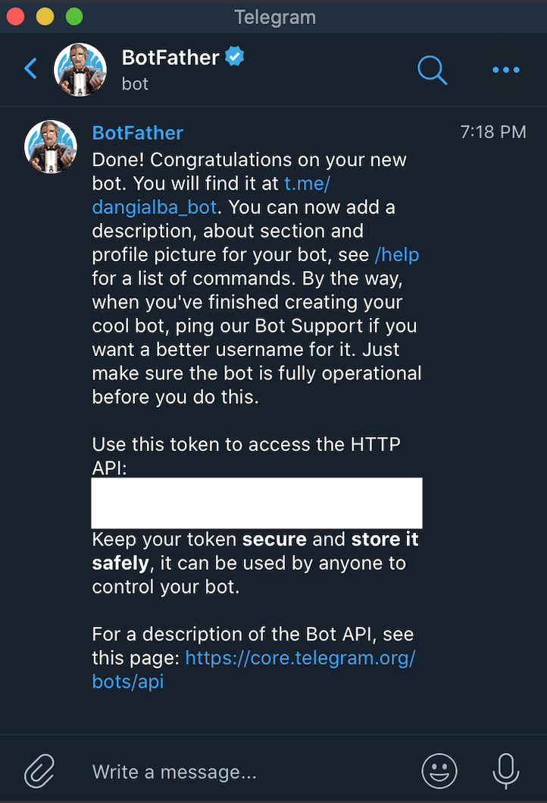
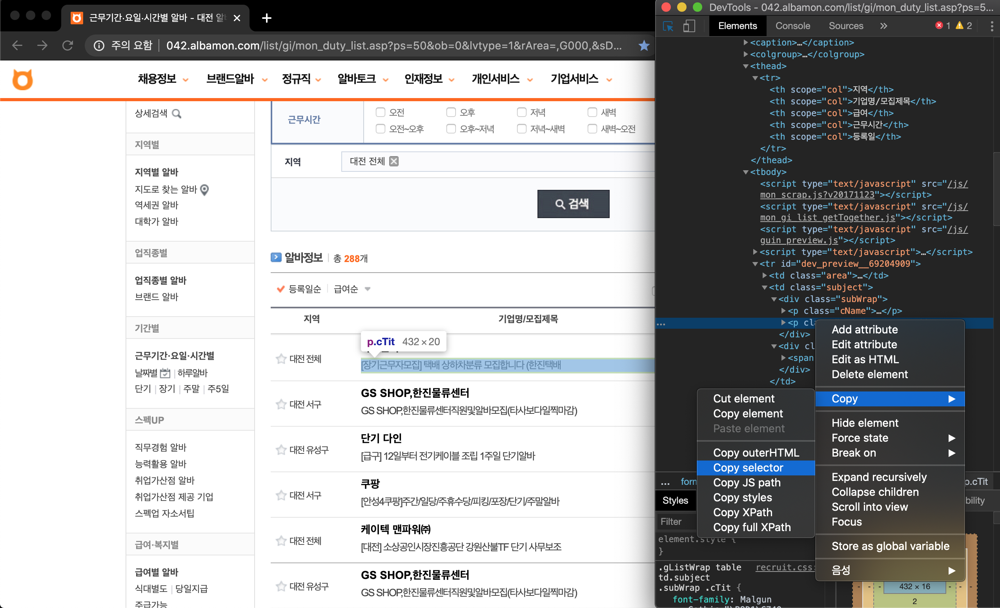
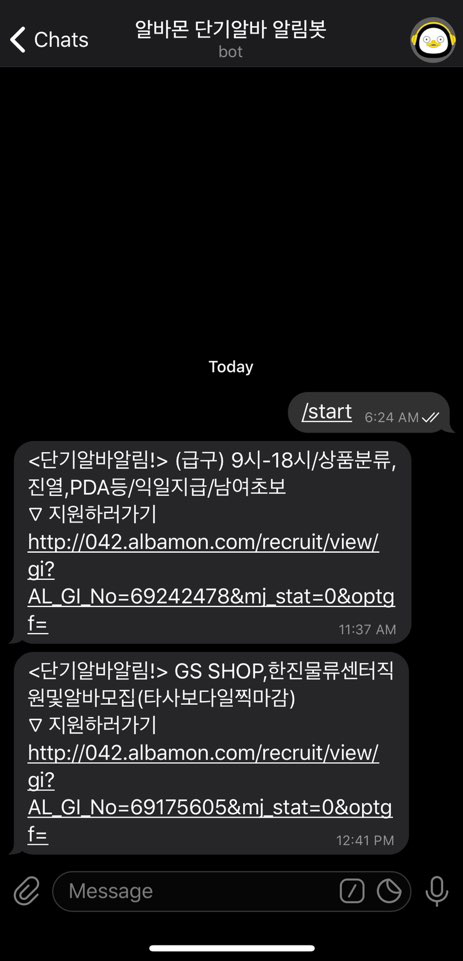

---
title: '🤖 간단한 Telegram Bot 만들어보기'
date: 2020-5-12 00:31:18
category: 'Python'
draft: false
---   

## Intro
대부분의  취준생들은  돈이  부족하다. 고정적인  알바를  할  수  있지만  그렇게  하기는 시간적으로  부담이  되서  단기  알바를  찾게 된다. 대전  지역에는  단기  알바  공고가  많이  없고, 공고가  올라오면  많은  사람이  지원하기  때문에  선착순으로  마감  후  내리는  경우가  많다. 즉, 빨리 지원하는 사람이  알바를  할 수 있는 확률이  높다. 어플에  맞춤알바  알림  기능이  있지만  알림이  제대로  오지  않아서  사이트를  수시로  확인을  해야하는  번거로움이  있었다. 그래서  알바몬  사이트에  단기  알바  공고가  올라오면  알림  메세지를  보내주는  새  글  알림  텔레그램  봇을  만들어  보았다.

## Process
### 텔레그램 봇 생성
텔레그램 설치 후 *BotFather* 를 검색하여 추가한다.   
채팅창에 */newbot* 을 입력 후 봇의 이름을 정해준다.   

   
  

이 메세지를 받았다면 정상적으로 봇이 생성이 된 것이다.   
다시  생성한  봇의 이름을  검색하고 추가하여 */start* 를  입력한다.   
그리고 테스트로 메세지를 하나 보내놓는다.   
```python
bot = telegram.Bot(token='Use this token to access the HTTP API')

for i in bot.getUpdates():
    print(i.message)
```
결과에서 'chat': {'id': **1234567890**, …} 이 부분의 숫자를 chat_id에 입력한다.

```python
bot.sendMessage(chat_id=1234567890, text="테스트입니다.")
```    

봇에게  *"테스트입니다."* 메세지를  받으면  텔레그램 봇 세팅은 끝이다.   

### 웹 크롤링
웹 크롤링에서 중요한 것은 원하는 정보만 가져오는 것이다.   
크롬의 *개발자도구 (F12)* 를 사용해서 필요한 부분을 클릭 후 *Copy selector* 로 가져온다.

   
   


### 코드   

해당 페이지의 공고 중 첫 번째에 게시된 글의 제목을 가져온다.   
```python
html = requests.get('URL')
html.encoding = 'euc-kr'
soup = BeautifulSoup(html.text, 'html.parser')
posts = soup.select('p.cTit')
latest = posts[0].text
```   
첫 번째 게시된 공고의 제목이 *latest.txt* 에 저장이 되고,    
그 제목이 같지 않을 경우 새로운 공고의 제목을 메세지로 알려준다.   
```python
with open(os.path.join(BASE_DIR, 'latest.txt'), 'r+') as f_read:
    before = f_read.readline()
    f_read.close()
        if before != latest:
            bot.sendMessage(chat_id=chat_id, text=latest+' \nURL')
            with open(os.path.join(BASE_DIR, 'latest.txt'), 'w+') as f_write:
                f_write.write(latest)
                f_write.close()
```   
30초마다 확인하도록 설정했다.   
```python
sched = BlockingScheduler()
sched.add_job(job_function, 'interval', seconds=30)
sched.start()
```
### 봇 실행   
잘 동작하는지 확인해본다!
  
```shell
python alba_crawler.py
```   
   

## Review
어제 배운 [movie_crawler](https://github.com/DeepxHyeon/movie_crawler)를 토대로 내가 불편함을 느꼈던 곳에 바로 적용해보았다. 이 정도로 정리를 해본 건 처음인데 검색하면 나오는  보기 좋게 잘 정리된 글들...정말 감사합니다. 테스트 후에 AWS로 배포까지 마쳤다. 취업하기 전까지 잘 사용해야겠다. 아쉬운 점이 있다면 택배 알바 알림이 너무 많이 온다는 것ㅠㅠ택배는 알바라고 할 수 없다. 이 부분은 나중에 개선해봐야겠다.    

## Reference   
[웹페이지 업데이트를 알려주는 Telegram 봇](https://beomi.github.io/gb-crawling/posts/2017-04-20-HowToMakeWebCrawler-Notice-with-Telegram.html)    
[파이썬으로 영화 예매 오픈 알리미 만들기](https://www.inflearn.com/course/%EC%98%81%ED%99%94%EC%98%88%EB%A7%A4-%ED%8C%8C%EC%9D%B4%EC%8D%AC#)

